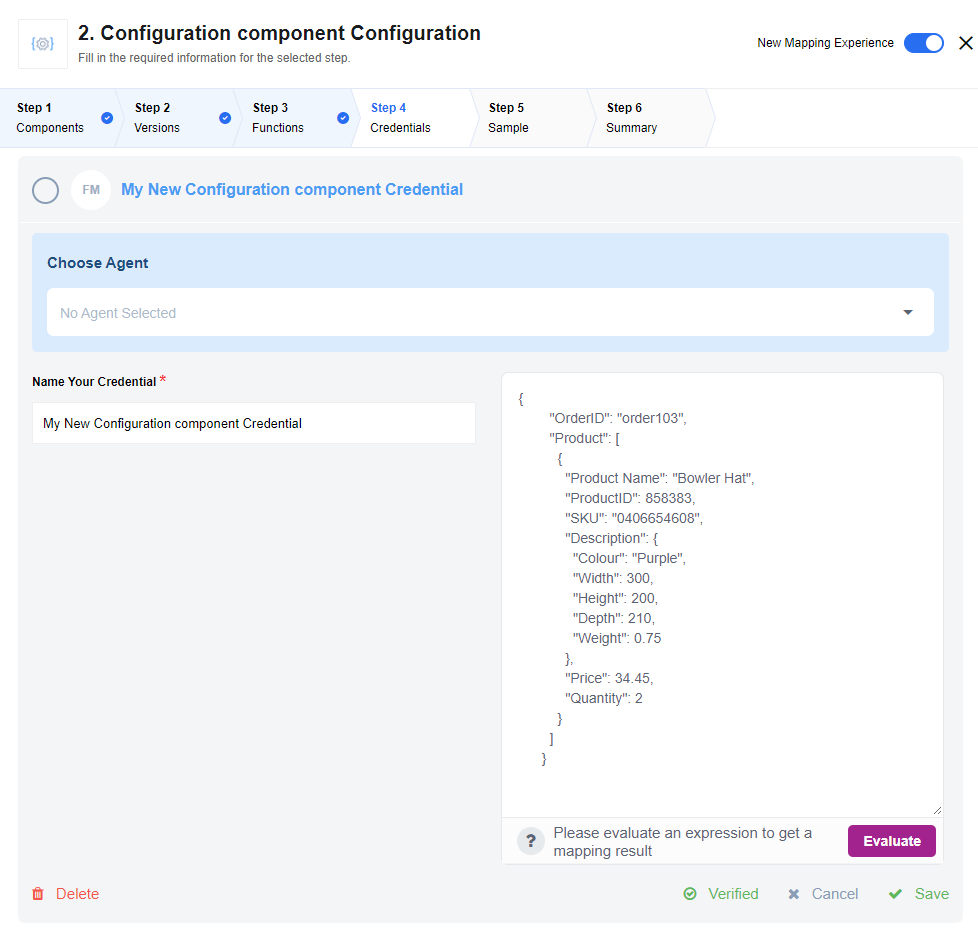

<<<<<<< HEAD
<<<<<<< HEAD
## Description

<<<<<<< HEAD
The configuration component allows separating the modification of configurable
values from the modification of the flow.
=======
**0.0.3 (October 30, 2020)**

* Update sailor version to 2.6.18
* Annual audit of the component code to check if it exposes a sensitive data in the logs
* Add circle.ci automation build

> To see the full **changelog** please use the following [link](changelog).
>>>>>>> 340e7db6963c6b497fe65b0472ea33c940a2c291

### How it works.  API version / SDK version
=======
=======
>>>>>>> a48af29eaa496fe803a5dc6fa840a9bb65e8d20b
## How works.  API version / SDK version
>>>>>>> c043adb98d7b64beed79053a4d1719f77355e324

Configuration component has a credential which is a text field with the following
rules:

*   It must be a valid JSON in order for the credentials to be verified.
*   It must not exceed 5KB in size.

The screenshot below shows the configuration component *Choose Credential* stage
during the integration flow design. The text field will be evaluated to check if
the above conditions are met.



Afterwards, it emits a message with an object equivalent to the JSON in the configuration.
So any data which is used in the flow and is repeated in multiple places can be
configured (or later changed) in the single step. After that new values are used
where it is needed.

<<<<<<< HEAD
### Requirements

#### Environment variables
=======
### Environment variables
>>>>>>> c043adb98d7b64beed79053a4d1719f77355e324

No environment variables are necessary to configure the component.

## Credentials

Configuration data should be specified as credentials of a JSON format. JSON
must be valid in order for credentials to be verified (except arrays, see the
[Known limitations below](#known-limitations)). Credentials verification will
fail otherwise.

Input data example. Consider the following example:

*   Someone wants to synchronize prices between an ERP and an E-SHOP
*   The price logic is so complex that it can not pragmatically exist in a single flow.
*   Prices in the ERP exist in only in currency A. Prices in the E-SHOP are in currency B. The customer wants to convert prices as data is moved between systems at a fixed rate that they set.
*   This fixed rate must be the same between all flows.

If the configuration component existed, you build flows of the following form:
```
ERP.GetPriceInfo()
  -> Config.LoadConfig()
    -> E-SHOP.SetPrice(price := ERPResults.Price * ConfigResults.ExchangeRate)
```

If one needed to change the exchange rate, that value could be edited by modifying
the configuration credentials to include the new rate and then resetting the snapshot
for all the price import flows. Currency rates sample:

```json
{
  "USDEUR": 0.881715,
  "USDFJD": 2.115102,
  "USDPLN": 3.787097,
  "USDQAR": 3.641042,
  "USDUAH": 30.718014,
  "USDZWL": 322.355011
}
```

Then the currency rate can be used in any number of flows, where it is needed
and then changed form the single place. That changes will affect all the flows
where it is used.

### Technical Notes

The [technical notes](technical-notes) page gives some technical details about Configuration component like [changelog](/components/configuration/technical-notes#changelog).

## Triggers

The configuration component has no trigger functions.
This means **the component can not be selected as a first step in any integration flow.**

## Actions

### Emit data

`Emit data` action emits the configuration data as a valid JSON object in a message.
The output json schema can have any complexity.

## Known limitations

1.  As realtime flows use credentials which were saved at the moment of starting the flow, **this component should be used only in ordinary flows**. This is not a bug or limitation, but the platform specific case.
2.  Despite naked arrays are valid JSON, there are some platform limitations, which do not allow to access the data in such arrays, that has been emitted from a component, from the next step. This is why **the naked arrays should not be passed to the component directly**. So instead of

```json
[
 {
   "Product Name": "Bowler Hat",
   "ProductID": 858383,
   "SKU": "0406654608",
   "Description": {
     "Colour": "Purple",
     "Width": 300,
     "Height": 200,
     "Depth": 210,
     "Weight": 0.75
   },
   "Price": 34.45,
   "Quantity": 2
 }
]
```
use something like:

```json
{
  "Product": [
    {
      "Product Name": "Bowler Hat",
      "ProductID": 858383,
      "SKU": "0406654608",
      "Description": {
        "Colour": "Purple",
        "Width": 300,
        "Height": 200,
        "Depth": 210,
        "Weight": 0.75
      },
      "Price": 34.45,
      "Quantity": 2
    }
  ]
}
```
